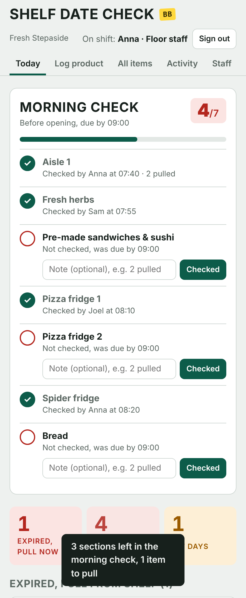
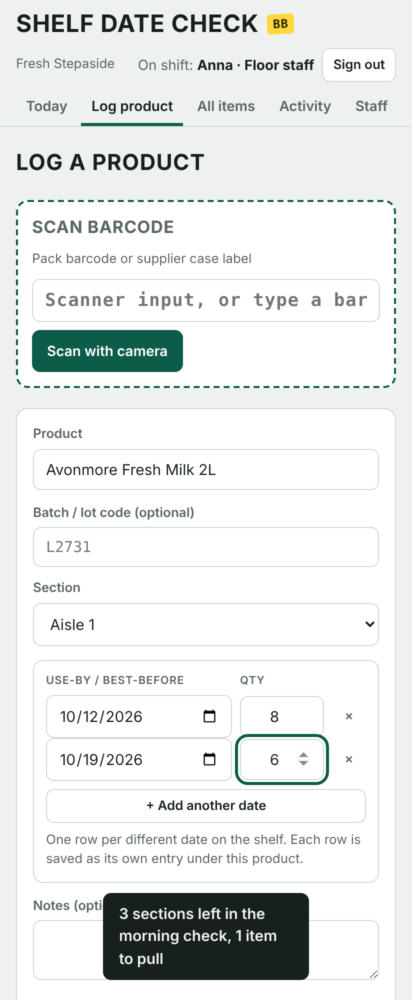
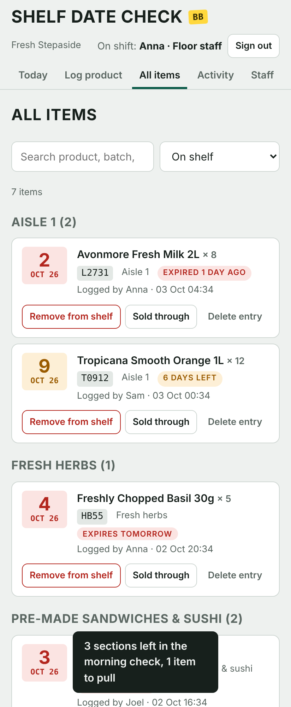

# Shelf Date Check

A shared out-of-date stock tracker for a grocery shop floor. Staff log products by use-by date and batch, tick off their morning and evening section checks, and managers see who did what, all from a phone on one web app.

Built for a real shop (Fresh, Stepaside, Dublin) to replace handwritten date-check sheets and handheld check devices.

-0d5c4a)


**Live:** https://zedatechecker.web.app (staff need a login)

<p align="center">
  
  
  
</p>

## What it does

- **Morning and evening checks.** The Today screen opens on the current round and lists every section to check, with who ticked it and when. A progress bar and start-of-shift summary show what is still outstanding.
- **Multi-date logging.** Log one product with several use-by dates and quantities at once (+ Add another date). Each date is saved as its own tracked entry.
- **Barcode scanning.** Phone camera or a Bluetooth/USB scanner. Reads normal pack barcodes and supplier GS1-128 / DataMatrix / QR case labels, pulling batch and expiry straight off the label where present.
- **Product name lookup.** Unknown barcodes are looked up on [Open Food Facts](https://world.openfoodfacts.org) and the suggested name is remembered locally after the first save, so it is instant and works offline next time.
- **Sections.** Shelf areas (Aisle 1, Bread, Pizza fridge, and so on) drive both the check rota and the grouping on All items. Any staff member can add a new one while logging.
- **Positions.** Floor staff, Supervisor, Manager. What each can do is enforced in the database rules, not just hidden in the UI.
- **Activity log.** Every log, removal and section check is recorded with who did it and when, plus a 7-day tally per person.
- **Works offline.** Entries save on the device on patchy shop Wi-Fi and sync when the connection returns.

## How it is used

Each staff member signs in on their own phone with a **username and PIN** and adds the app to their home screen. No app store, no shared device required.

- **Floor staff** do the morning and evening checks, log products, remove from shelf, mark sold through, delete a mistaken entry.
- **Supervisors** also undo a removal or sale.
- **Managers** also run the Staff tab: add people, change positions, reset PINs, deactivate staff, set the check times and manage sections.

There is a hidden owner login used only for first-time setup and as a backup if every manager is locked out.

## Tech

A single-page app with **no build step**: plain HTML, CSS and vanilla JavaScript.

- **Firebase Auth** (email/password behind friendly usernames) for per-person logins.
- **Cloud Firestore** for realtime shared data with an offline cache.
- **Firebase Hosting** for the static site.
- [`html5-qrcode`](https://github.com/mebjas/html5-qrcode) for camera scanning; the [Open Food Facts](https://world.openfoodfacts.org/data) API for product names.

Layout:

```
public/
  index.html          app shell, styles, markup
  app.js              all of the app logic
  firebase-config.js  Firebase web config (not secret)
  manifest.webmanifest, icon-*.png, icon.svg
firestore.rules       access rules (the real security boundary)
firebase.json         hosting + rules config
SETUP.md              full Firebase setup and deploy walkthrough
```

## Run your own

You need Node.js and a free Firebase project. Point `public/firebase-config.js` and the owner email in `firestore.rules` at your project, then:

```
npm install -g firebase-tools
firebase login
firebase deploy
```

Full step-by-step, including Auth and Firestore setup, is in [SETUP.md](SETUP.md).

## Security model

- Nothing is visible until a user signs in; the sign-in screen shows no names.
- Positions are enforced in `firestore.rules`, so a floor-staff login cannot change positions, add people or undo removals even by calling the database directly.
- Every write is signed with the person's own identity, so entries cannot be logged under someone else's name.
- Items and staff are never hard-deleted, so the audit trail stands.
- The Firebase web API key in `firebase-config.js` is public by design (it ships in the client either way); access is controlled by the rules, not the key.

## Contributing

Issues and pull requests are welcome. It is a small, dependency-light codebase: almost everything lives in `public/app.js` and `public/index.html`, with access rules in `firestore.rules`.

To work on it locally, point it at a throwaway Firebase project (see SETUP.md) and run `firebase serve` or `firebase emulators:start`. Keep the no-build, vanilla-JS approach, and remember that any new rule in the UI needs a matching rule in `firestore.rules`.

Ideas that would help: CSV export for audits, a recall-batch lookup, waste/markdown reporting, and per-round sections (some sections only checked once a day).

## Credits

Created by **Oz7y**. Idea by **Sameer**.

## License

MIT, see [LICENSE](LICENSE).
